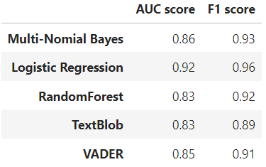
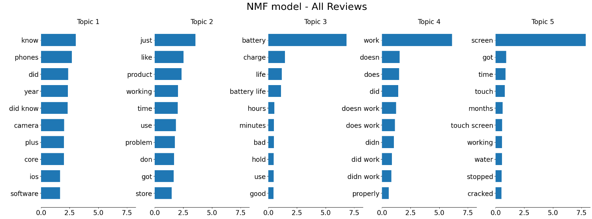

# Feedback Extraction from Product Reviews

This project aims to identify and extract tangible feedback from product reviews posted on Amazon. This is accomplished in two stages: in the first stage a sentiment analysis is utilized to ascertain whether product reviews are positive or negative. In the second stage, reviews identified as "negative sentiment" are analyzed to assess if we can determine any themes or common topics emerging. The dataset is an extract of ~400K reviews of various various products (predominantely electronics) from Amazon. This project is executed in Python, using predominantly the nltk/spacy and sklearn libraries. 

### What is sentiment analysis?
Sentiment analysis is a growing genre of text analysis that aims to assess the tone or emotion, a.k.a sentiment, associated with text. It gained a lot of mainstream attention in 2020, when stock analysts were especially interested in mining posts from popular subreddits such as r/wallstreetbets to try ascertain the retail investor sentiments about meme stocks via their posts, as thus, predict their potential trading actions. 

This is an introductory project and as such, focuses on more traditional machine learning/sklearn based techniques for sentiment analysis. Two vectorizers - CountVectorizer and TfidfVectorizer and three sklearn models - multinomial naivebaiyes, logistic regression and random forest classifiers, are explored. Gridsearch based parameter tuning is performed to determine the optimal number of features and other parameters for the vectorizers and each of the models. Based on this analysis, <b>a Countvectorizer with the following parameters, and Logistic Regression are chosen for the sentiment analysis final model</b>. 
   * min_df = 5 (must appear in atleast 5 documents)
   * max_df = 0.75 (must not appear is more than 0.75 documents
   * max_features = 10000
   * bigrams

Today, many state of the art packages exist which essential allow for plug and play sentiment analysis without the need to model training; as a tangential goal, two such popular packages, <b>TextBlob and VADER</b> are briefly explored in this project. TextBlob is a pretrained package that provides polarity scores which can be used for sentiment analysis; in this project, any polarities <0 are considered negative sentiment and others are considered positive sentiment. Similarly VADER is also a pretrained package that provides a "compound score" that can be used to determine sentiment. Both these models performed quite well especially if we consider that these can be used without the need for additional training and with potentially unsupervised data

Comparative AUC and F1 scores for all the options considered for the sentiment analyzer are shown below:

  

### What is topic modeling?
Topic modeling aims to create coherent groupings of words to glean common themes ("topics") from the text corpus. Non-negative Matrix Factorization and Latent Dirichlet Allocation are utilized to explored project reviews for a subset of the products (in particular, Apple iphones). 

Issues primarily appear to be related to 
1. <b>the screen</b> (touch screen stops working, or screen cracks);
2. <b>battery life</b> (batter does not hold charge).
3. to a smaller extent some reviews mention <b>camera and iOS software isues</b> as well

  

Note this is an academic dataset (repurposed from a UMich Course) so the data is quite dated and also the amount of data available for topic modeling is quite small, which impacts the quality of the results

###
#### Development Timeline
|Phase|Timeline| Decription |
|:---:|:---:|:---|
|P1 |Jul 2024|Initial Version: Focus is sentiment analysis using standard machine learning classification techniques|
|P2|Aug - Sept 2024|Topic modeling for negative reviews on a subset of products using Non Negative Matrix Factorization and Latent Dirichlet Allocation|
